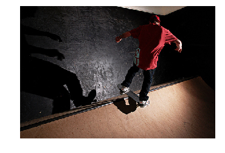
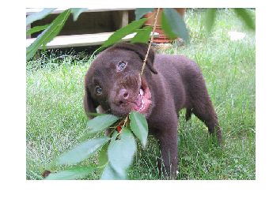
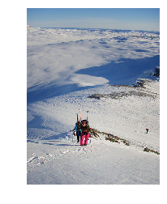
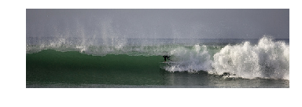

# image_captioning
Image Captioning refers to the process of generating textual description from an image – based on the objects and actions in the image.

The task is straightforward – the generated output is expected to describe in a single sentence what is shown in the image – the objects present, their properties, the actions being performed and the interaction between the objects, etc. But to replicate this behaviour in an artificial system is a huge task, as with any other image processing problem and hence the use of complex and advanced techniques such as Deep Learning to solve the task.

# Dataset
The dataset used is flickr8k. Which is a Dataset of 8000 images with 5 captions each

# Steps
1)Text Prepocessing
- Reading Captions and creating a dictionary of image_id : list_of_captions
- Text cleaning of captions (converting captions to lower case, remove punctuation and 1 length words)
- Sorting the frequently occuring words and using them in the project
- Creating a dictionary of words_to_idx and idx_to_words
- Creating word embeddings matrix using glove vectors

2)Image Preprocessing
- prepocessing the image and then feeding it into resnet50 model
- using the resnet50 pretrained model we obtain 2048 vector for each image
- Creating a dictionary of image_name: resnet_encoded_img_vector

3)Creating the train and test dictionaries for using during training

4)Creating custom data generator 
- Generating training data 
- Each x-label contains the encoded image and a word of the caption while y-label contains next word to be predicted

5)Creating the model and training
- I trained for 10 epochs on 6000 training images

|  Output       |  Caption    |
| :------------- | :----------: |
|   |  skateboarder is doing stunt on skateboard   | 
|   | black dog is running through the grass |  
|     | two people are walking along snowy mountain |
|     | surfer in the middle of crashing |
|     | black dog running through water |
 
